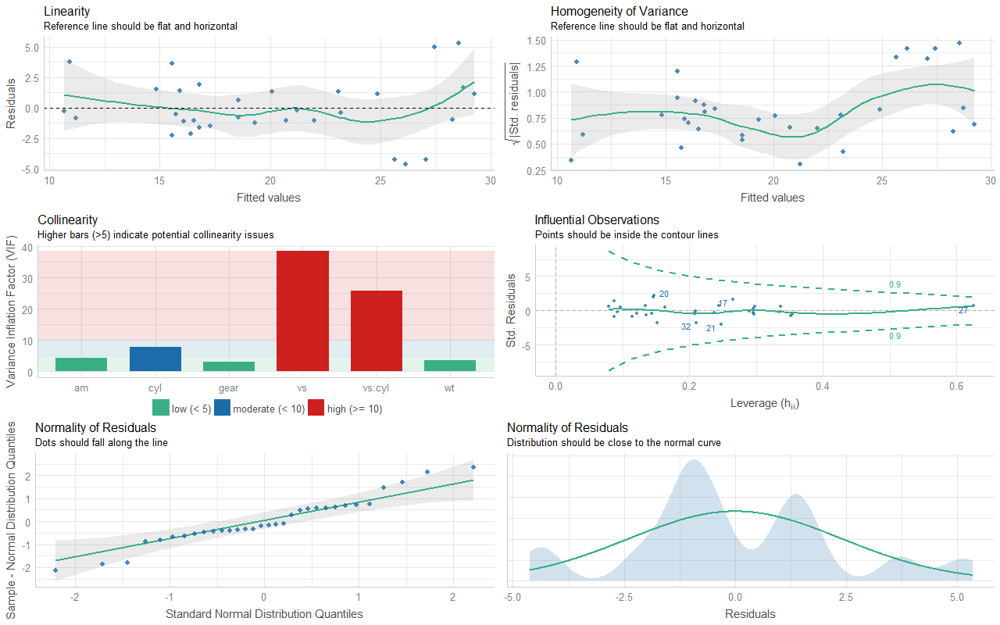
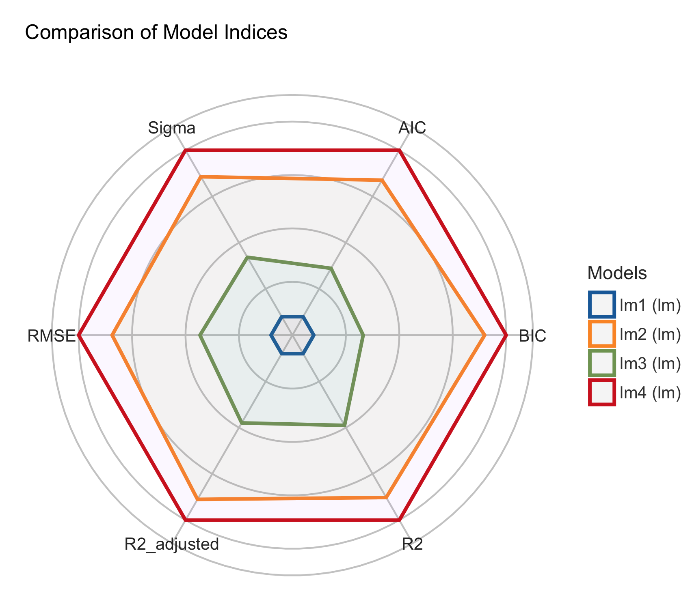

# Summary

A crucial part of statistical analysis is evaluating a model's quality and fit, or *performance*. During analysis, especially with regression models, investigating the fit of models to data also often involves selecting the best fitting model amongst many competing models. Upon investigation, fit indices should also be reported both visually and numerically to bring readers in on the investigative effort. While functions to build and produce diagnostic plots or to compute fit statistics exist, these are located across many packages, which results in a lack of a unique and consistent approach to assess the performance of many types of models. The result is a difficult-to-navigate, unorganized ecosystem of individual packages with different syntax, making it onerous for researchers to locate and use fit indices relevant for their unique purposes. The *performance* package in R fills this gap by offering researchers a suite of intuitive functions with consistent syntax for computing, building, and presenting regression model fit statistics and visualizations.

# Aims of the Package

The *performance* R-package [@rcore] provides utilities for computing measures to assess model quality, many of which are not directly provided by R's *base* or *stats* packages. These include measures like $R^2$, intraclass correlation coefficient (ICC), root mean squared error (RMSE), or functions to check for vexing issues like overdispersion, singularity, or zero-inflation. These functions support a large variety of regression models including generalized linear models, (generalized) mixed-effects models, their Bayesian cousins, and many others.

*performance* is part of the [*easystats*](https://github.com/easystats/performance) ecosystem, which is a collaborative project focused on facilitating simple and intuitive usage of R for statistical analysis [@benshachar2020effectsize; @ludecke2020see; @Lüdecke2020parameters; @makowski2019bayetestR; @Makowski2020correlation].

# Comparison to other Packages

Compared to other packages (e.g., *lmtest* [@lmtest], *MuMIn* [@MuMin], *car* [@car], *broom* [@robinson_broom_2020]), the *performance* package offers functions for checking validity *and* model quality systematically and comprehensively for many regression model objects such as (generalized) linear, mixed-effects, and Bayesian. *performance* also offers functions to compare and test multiple models simultaneously to evaluate the best fitting model to the data.

# Features

Beyond validity and quality checks and consistent with *easystats* syntax, *performance* also includes plotting functions via the [*see* package](https://easystats.github.io/see/) [@ludecke2020see].^[A complete overview of plotting functions is available at the *see* website (<https://easystats.github.io/see/articles/performance.html>).]

## Checking Model Assumptions

Inferences made from regression models such as significance tests or interpretation of coefficients require meeting several assumptions, which vary based on the type of model. *performance* offers a collection of functions to check if assumptions are met. To demonstrate the efficiency of the package, we overview a few functions, followed by a broader function that runs a comprehensive suite of checks in a single call.

For example, linear (Gaussian) models assume constant error variance (homoscedasticity). We can use `check_heteroscedasticity()` from *performance* to check if this assumption has been violated.

``` {.r}
data(cars)
model <- lm(dist ~ speed, data = cars)

check_heteroscedasticity(model)

#> Warning: Heteroscedasticity (non-constant error variance) detected (p = 0.031).
```

For another example, Poisson regression models assume equidispersion. Violating this assumption leads to *overdispersion*, which occurs when the observed variance in the data is higher than the expected variance from the model. We can call `check_overdispersion()` to check if overdispersion is an issue.

``` {.r}
library(glmmTMB)
data(Salamanders)
model <- glm(count ~ spp + mined, family = poisson, data = Salamanders)

check_overdispersion(model)

#> # Overdispersion test
#> 
#>        dispersion ratio =    2.946
#>   Pearson's Chi-Squared = 1873.710
#>                 p-value =  < 0.001
```

In addition to tests for checking assumptions, *performance* also provides convenience functions to *visually* assess these assumptions of regression models. *performance*'s visual checks detect the type of model passed to the function call, and return the appropriate visual checks for each model type. At present, there are many supported regression models, such as linear models, linear mixed-effects models, their Bayesian equivalents, and more. Inspect the package documentation for a complete listing.

For example, consider the visual checks from a simple linear regression model.

<!-- TO DO: Regenerate plot once feedback from other has been incorporated -->

``` {.r}
library(see)

model <- lm(Sepal.Length ~ Species + Sepal.Width + 
            Petal.Length + Petal.Width, data = iris)
            
check_model(model)
```



## Computing Quality Indices of Models

*performance* offers a number of indices to assess the goodness of fit of a model. For example, $R^2$, also known as the coefficient of determination, is a popular statistical measure to gauge the amount of the variance in the dependent variable accounted for by the specified model. The `r2()` function from *performance* computes and returns this index for a variety of regression models. Depending on the model, the returned value may be $R^2$, pseudo-$R^2$, or marginal/adjusted $R^2$.

First, consider a simple linear model.

``` {.r}
model <- lm(mpg ~ wt + cyl, data = mtcars)

r2(model)

#> # R2 for Linear Regression
#> 
#>        R2: 0.830
#>   adj. R2: 0.819
```

Next, consider a mixed-effects model.

``` {.r}
library(lme4)
model <- lmer(
  Petal.Length ~ Petal.Width + (1 | Species),
  data = iris
)

r2(model)

#> # R2 for Mixed Models
#> 
#>   Conditional R2: 0.933
#>      Marginal R2: 0.303
```

Similar to $R^2$, the Intraclass Correlation Coefficient (ICC) provides information on the explained variance and can be interpreted as the proportion of the variance explained by the grouping structure in the population [@hox2017multilevel]. The `icc()` function from *performance* computes and returns the ICC for various mixed-effects regression models.

``` {.r}
library(brms)
set.seed(123)
model <- brm(mpg ~ wt + (1 | cyl) + (1 + wt | gear), 
  data = mtcars
  )

icc(model)

#> # Intraclass Correlation Coefficient
#> 
#>      Adjusted ICC: 0.930
#>   Conditional ICC: 0.771
```

Instead of computing and returning individual indices, users can obtain *all* indices from the model by simply passing the fitted model object to `model_performance()`. A list of computed indices is returned, which might include $R^2$, AIC, BIC, RMSE, ICC, LOOIC, etc.

For example, consider a simple linear model.

``` {.r}
m1 <- lm(mpg ~ wt + cyl, data = mtcars)

model_performance(m1)

#> # Indices of model performance
#> 
#> AIC     |     BIC |    R2 | R2 (adj.) |  RMSE | Sigma
#> -----------------------------------------------------
#> 156.010 | 161.873 | 0.830 |     0.819 | 2.444 | 2.568
```

Next, consider a mixed-effects model.

``` {.r}
library(lme4)
m3 <- lmer(Reaction ~ Days + (1 + Days | Subject), data = sleepstudy)

model_performance(m3)

#> # Indices of model performance
#> 
#> AIC      |      BIC | R2 (cond.) | R2 (marg.) |   ICC |   RMSE |  Sigma
#> -----------------------------------------------------------------------
#> 1755.628 | 1774.786 |      0.799 |      0.279 | 0.722 | 23.438 | 25.592
```

## Comparing Multiple Models

For multiple models, users can inspect a table of these indices by calling, [`compare_performance()`](https://easystats.github.io/performance/reference/compare_performance.html).

``` {.r}
data(iris)
lm1 <- lm(Sepal.Length ~ Species, data = iris)
lm2 <- lm(Sepal.Length ~ Species + Petal.Length, data = iris)
lm3 <- lm(Sepal.Length ~ Species * Sepal.Width, data = iris)
lm4 <- lm(Sepal.Length ~ Species * Sepal.Width + 
          Petal.Length + Petal.Width, data = iris)

compare_performance(lm1, lm2, lm3, lm4)

#> # Comparison of Model Performance Indices
#> 
#> Name | Model |     AIC |     BIC |    R2 | R2 (adj.) |  RMSE | Sigma
#> --------------------------------------------------------------------
#> lm1  |    lm | 231.452 | 243.494 | 0.619 |     0.614 | 0.510 | 0.515
#> lm2  |    lm | 106.233 | 121.286 | 0.837 |     0.833 | 0.333 | 0.338
#> lm3  |    lm | 187.092 | 208.167 | 0.727 |     0.718 | 0.431 | 0.440
#> lm4  |    lm |  78.797 | 105.892 | 0.871 |     0.865 | 0.296 | 0.305
```

As noted previously, in addition to the returning numeric results, *performance* also offers visualizations of model fit indices.

``` {.r}
library(see)

plot(compare_performance(lm1, lm2, lm3, lm4))
```

<!-- TO DO: too big; change dimensions before submission -->



## Testing Models

While comparing these indices is often useful, making a decision such as whether to keep or drop a model, can often be difficult as some indices can give conflicting suggestions. Additionally, it may be unclear which index to favour in different contexts. This difficulty is one of the reasons why *tests* are often useful as they facilitate decisions via "significance" indices like *p*-values (in a frequentist framework) or [Bayes Factors](https://easystats.github.io/bayestestR/articles/bayes_factors.html) (in a Bayesian framework).

The generic `test_performance()` function computes the appropriate test(s) based on the supplied input. For instance, the following example shows results from *Vuong's Test* [@vuong_likelihood_1989].

``` {.r}
test_performance(lm1, lm2, lm3, lm4)

#> Name | Model | Omega2 | p (Omega2) |    LR | p (LR)
#> ---------------------------------------------------
#> lm1  |    lm |        |            |       |       
#> lm2  |    lm |   0.69 |     < .001 | -6.25 | < .001
#> lm3  |    lm |   0.36 |     < .001 | -3.44 | < .001
#> lm4  |    lm |   0.73 |     < .001 | -7.77 | < .001
#> Each model is compared to lm1.
```

*performance* also provides `test_bf()` to compare models via Bayes factors in a Bayesian framework.

``` {.r}
test_bf(lm1, lm2, lm3, lm4)

#> # Bayes Factors for Model Comparison
#> 
#> Model                                                           BF
#> [lm2] Species + Petal.Length                             3.446e+26
#> [lm3] Species * Sepal.Width                              4.692e+07
#> [lm4] Species * Sepal.Width + Petal.Length + Petal.Width 7.584e+29
#> 
#> * Against Denominator: [lm1] Species
#> *   Bayes Factor Type: BIC approximation
```

# Licensing and Availability

*performance* is licensed under the GNU General Public License (v3.0), with all source code stored at GitHub (<https://github.com/easystats/performance>), and with a corresponding issue tracker for bug reporting and feature enhancements. In the spirit of honest and open science, we encourage requests, tips for fixes, feature updates, as well as general questions and concerns via direct interaction with contributors and developers.

# Acknowledgments

*performance* is part of the collaborative [*easystats*](https://github.com/easystats/easystats) ecosystem. Thus, we thank the [members of easystats](https://github.com/orgs/easystats/people) as well as the users.

# References
